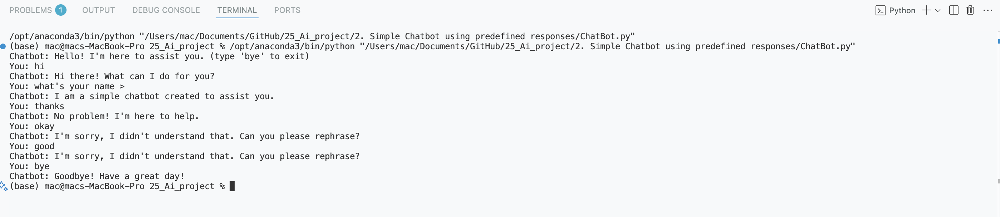

# Simple Chatbot using Predefined Responses

This project is a simple rule-based chatbot implemented in Python. The chatbot responds to user inputs with predefined responses based on keywords.

## How to Run

1. Make sure you have Python installed on your system.
2. Run the chatbot script:
   ```bash
   python ChatBot.py
   ```
3. Type your messages and interact with the chatbot. Type `bye` to exit.

## Example Output

Below is an example of a conversation with the chatbot:

```
Chatbot: Hello! I'm here to assist you. (type 'bye' to exit)
You: hello
Chatbot: Hello! How can I assist you today?
You: what's your name?
Chatbot: I am a simple chatbot created to assist you.
You: thank you
Chatbot: You're welcome! If you have more questions, feel free to ask.
You: bye
Chatbot: Goodbye! Have a great day!
```

You can also view a screenshot of the chatbot in action:



## Files

- [`ChatBot.py`](ChatBot.py): Main Python script for the chatbot.
- [`Output.png`](Output.png): Example output screenshot.